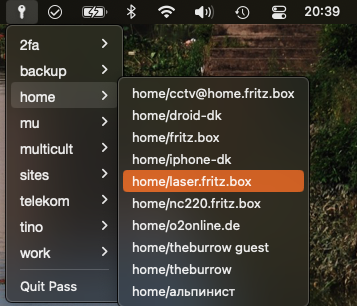

# Mac-Pass

People who like to keep their passwords to themselves use [Pass](https://www.passwordstore.org).
However, a decent MacOS integration seemed to be wanting.
Mac-Pass is a simple menu dropdown that copies the selected password
to the clipboard for some time (45 seconds by default).

It also supports OTP tokens if the appropriate `pass` extension (`pass-otp` in Homebrew) is present.
To use it, simply place an OTP URL (`otpauth://totp/...`) in the first line of a password file.

## Credits

The app was made with [Platypus](https://sveinbjorn.org/platypus), a great way to turn some measly lines of shell code into a Mac app.

The shell script borrows heavily from [passmenu](https://git.zx2c4.com/password-store/tree/contrib/dmenu/passmenu).
